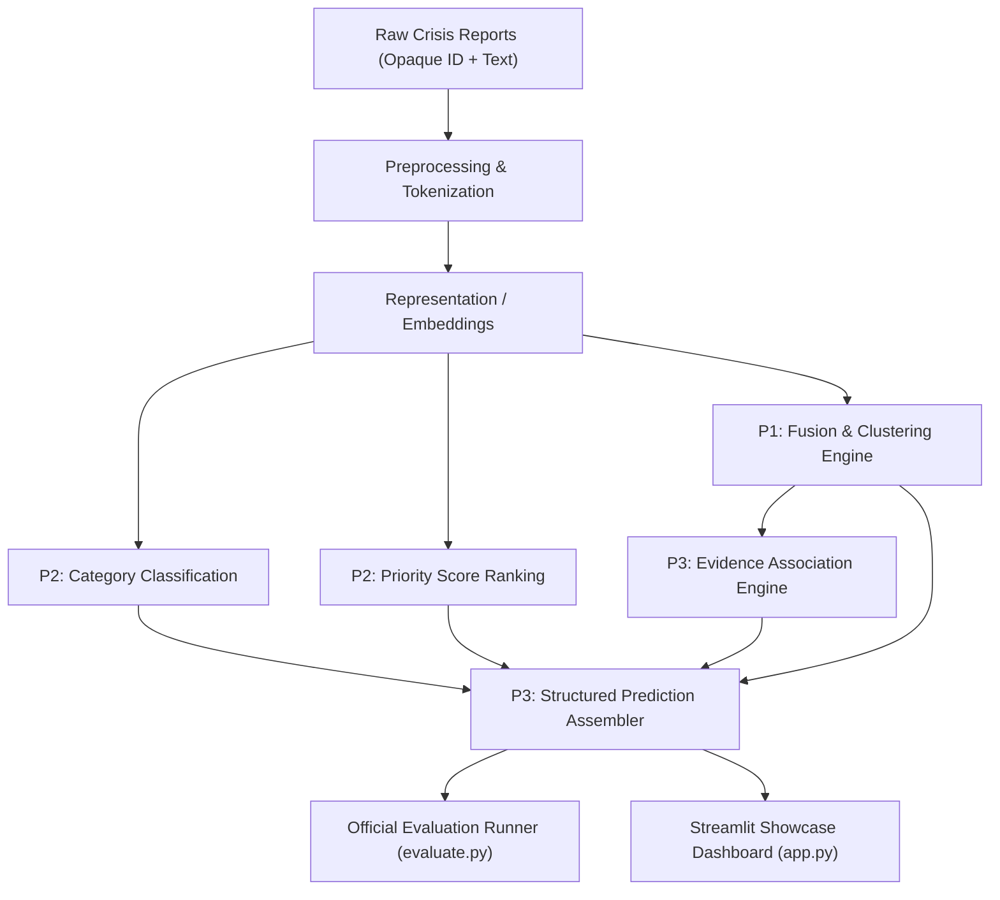

# Crisis Report Fusion and Priority Ranking (AI-03)

[]()
[]()
[]()

AI-03 Crisis Intelligence Platform: an integrated, end-to-end system that fuses multimodal crisis reports into distinct physical incidents, predicts humanitarian information categories, assigns operational priority scores, and strictly preserves verifiable evidence IDs.

---

## 1. System Architecture



For complete architectural details, see [docs/ARCHITECTURE.md](docs/ARCHITECTURE.md).  
For exact function signatures and interface contracts for P1, P2, and P3, see [docs/INTERFACES.md](docs/INTERFACES.md).

---

11 official categories

Your model predicts one of these:

Location — where something is happening
EmergingThreats — developing/new threats
MultimediaShare — photos/videos/media being shared
MovePeople — information about moving people
NewSubEvent — newly reported sub-event
FirstPartyObservation — direct observation from the scene
InformationWanted — request for information
ServiceAvailable — a service/resource is available
SearchAndRescue — search/rescue information
Volunteer — volunteer-related information
GoodsServices — goods/services-related information

## 2. Quickstart & Installation

### Prerequisites
- Python 3.10+ (tested on Python 3.14)
- Git

### Setup
```bash
# Clone the repository
git clone https://github.com/ankit07-techie/Crisis-Report-Fusion-and-Priority-Ranking.git
cd Crisis-Report-Fusion-and-Priority-Ranking

# (Optional) Create and activate a virtual environment
python -m venv .venv
# On Windows PowerShell:
.venv\Scripts\Activate.ps1
# On Linux / macOS:
source .venv/bin/activate

# Install dependencies
pip install -r requirements.txt
```

---

## 3. Running the Integration Pipeline

Use `src/pipeline.py` directly in Python:

```python
from src.schemas import Report
from src.pipeline import CrisisPipeline

pipeline = CrisisPipeline()

# Ingest single report
report = Report(id="DISPATCH_001", text="Suspension bridge on Route 9 collapsed into floodwaters.")
prediction = pipeline.process_report(report)

print(prediction.predicted_cluster_id)  # e.g., INCIDENT_001
print(prediction.category)              # e.g., Infrastructure Damage
print(prediction.priority_score)        # e.g., 4.2
print(prediction.evidence_ids)          # e.g., ['DISPATCH_001']
```

---

## 4. Official Evaluation Runner

`evaluate.py` accepts opaque inputs (containing only item IDs and report text) and produces strictly formatted prediction records:

```bash
# Evaluate JSONL input
python evaluate.py --input data/eval_input.jsonl --output data/predictions.jsonl

# Evaluate CSV input
python evaluate.py --input data/eval_input.csv --output data/predictions.csv --format csv
```

### Input Format Guarantee:
No ground-truth labels, source IDs, or cluster annotations are required or expected.

### Output Record Fields:
- `item_id`: Original report identifier
- `predicted_cluster_id`: Assigned incident cluster ID
- `category`: Predicted information category
- `priority_score`: Operational priority score (1.0 to 5.0)
- `evidence_ids`: Real report IDs corroborating the cluster

---

## 5. Streamlit Showcase & Demo

Launch the interactive emergency triage dashboard:

```bash
streamlit run app.py
```

### Key Features:
- **Live Report Triage**: Input field dispatches to view real-time incident clustering, category, urgency rating, and evidence IDs.
- **Semantic Fusion Demonstration**: Demonstrates that two differently worded crisis reports regarding the same physical emergency are assigned to the exact same incident cluster without hardcoding.
- **Batch Processing**: Upload CSV/JSONL files to batch-process reports and download structured predictions.

---

## 6. Running Integration Tests

Run the full automated integration test suite:

```bash
pytest tests/integration/ -v
```

---

## 7. Trunk & Branching Workflow (PRD Section 12)

- `main` is the sole long-lived branch and remains continuously runnable.
- Development tasks use short-lived branches:
  - `p3/bootstrap`: Schemas, interfaces, and architecture documentation.
  - `p3/pipeline`: Integration pipeline and evidence ID preservation engine.
  - `p3/evaluation`: Official evaluation CLI runner (`evaluate.py`).
  - `p3/dashboard`: Streamlit showcase web application (`app.py`).
