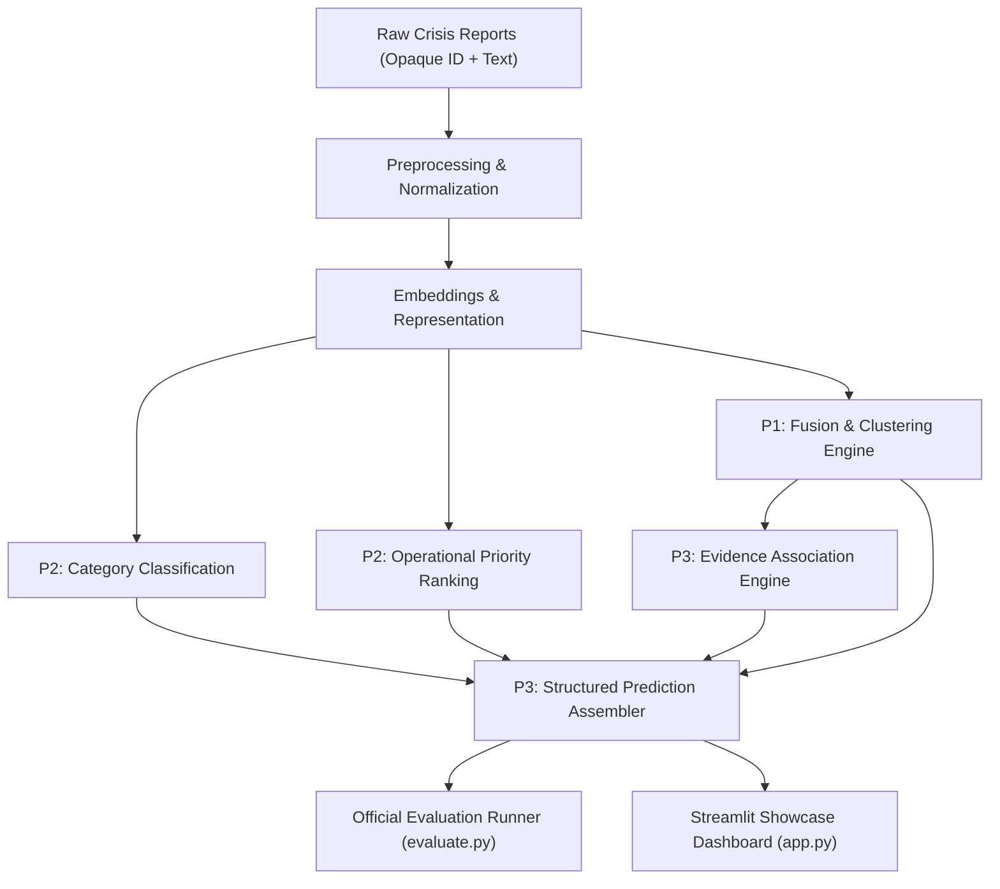

# System Architecture: Crisis Report Fusion and Priority Ranking (AI-03)

This document outlines the shared architecture for the AI-03 crisis intelligence platform. It establishes role boundaries, data flow pipelines, and integration contracts between team components.

---

## 1. High-Level Data Flow

---

## 2. Component Ownership and Responsibilities

| Role | Domain | Primary Responsibilities | Owned Files |
| :--- | :--- | :--- | :--- |
| **P1** | Clustering / Incident Fusion | Semantic clustering of crisis reports into distinct physical incidents. Generates cluster IDs and similarity metrics. | `src/clustering/` or `src/fusion.py` |
| **P2** | Classification & Priority | Multi-class information categorization and priority score prediction (1.0 to 5.0). | `src/classification/` or `src/priority.py` |
| **P3** | Integration, MLOps & Product | Shared schemas, pipeline orchestration, evidence ID preservation, evaluation runner, tests, and Streamlit demo. | `src/pipeline.py`, `src/evidence.py`, `src/schemas.py`, `src/config.py`, `evaluate.py`, `app.py`, `tests/integration/` |

---

## 3. Step-by-Step Architecture Pipeline

1. **Input Ingestion**:
   - Accepts raw reports containing opaque item identifiers and report text (`id`, `text`).
   - Evaluation runner does not rely on hidden source-to-variant linkage, cluster labels, or ground truth.

2. **Incident Fusion & Clustering (P1)**:
   - Groups disparate, differently worded reports regarding the same physical incident into unified incident clusters.
   - Assigns a stable `predicted_cluster_id`.

3. **Classification & Priority Scoring (P2)**:
   - Evaluates crisis content for humanitarian category (e.g. *Search & Rescue*, *Medical Assistance*, *Infrastructure Damage*).
   - Scores operational urgency on a standardized 1.0 to 5.0 scale.

4. **Evidence Association Engine (P3 - `src/evidence.py`)**:
   - Strictly preserves traceable evidence: every evidence ID associated with a prediction must be an actual report ID assigned to that incident cluster.
   - Prohibits synthetic ID generation or hidden metadata access.

5. **Structured Prediction Assembly (P3 - `src/pipeline.py`)**:
   - Consolidates output into typed `Prediction` and `EvaluationRecord` objects:
     - `item_id`: original report identifier.
     - `predicted_cluster_id`: assigned incident cluster.
     - `category`: information classification.
     - `priority_score`: operational urgency score.
     - `evidence_ids`: list of real report IDs corroborating the incident.

6. **Delivery Interfaces**:
   - **CLI Evaluation Runner (`evaluate.py`)**: Batched, headless evaluation over opaque inputs (CSV/JSONL).
   - **Streamlit Showcase (`app.py`)**: Human-centric incident triage and semantic fusion demonstration.
