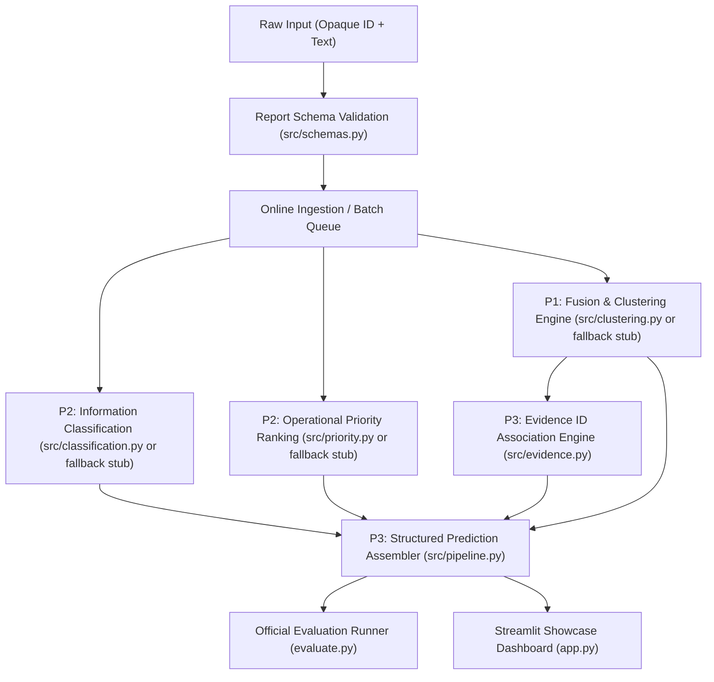

# P3 Codebase Comprehensive Audit Report

**Role**: P3 — Integration + Product / MLOps Engineer  
**Project**: AI-03 Crisis Report Fusion and Priority Ranking  
**Repository**: `https://github.com/ankit07-techie/Crisis-Report-Fusion-and-Priority-Ranking`  
**Date**: September 12, 2026  
**Status**: Verified & Ready for P1/P2 Integration  

---

## 1. Current Architecture



---

## 2. File-by-File Responsibility Matrix

| File Path | Owner | Core Responsibility |
| :--- | :--- | :--- |
| `src/schemas.py` | P3 | Independent Pydantic data schemas: `Report`, `ClusterResult`, `Prediction`, `EvaluationRecord`. |
| `src/config.py` | P3 | Immutable configuration settings, similarity thresholds, priority levels, categories. |
| `src/evidence.py` | P3 | Strict evidence ID preservation and registry. Prevents fabricated or synthetic IDs. |
| `src/pipeline.py` | P3 | End-to-end integration orchestrator. Dynamically discovers and binds P1/P2 modules with fallback stubs. |
| `src/stubs/clustering_stub.py` | P3 (Temp) | Isolated fallback clustering engine (TF-IDF + Cosine similarity) ensuring pipeline runnability before P1 lands. |
| `src/stubs/prediction_stub.py` | P3 (Temp) | Isolated fallback classification and priority scoring heuristics ensuring pipeline runnability before P2 lands. |
| `evaluate.py` | P3 | Official evaluation runner CLI. Ingests opaque item IDs and text without ground truth labels. |
| `app.py` | P3 | Streamlit showcase application for single triage, semantic fusion demo, and batch evaluation. |
| `docs/ARCHITECTURE.md` | P3 | High-level system architecture and component interactions. |
| `docs/INTERFACES.md` | P3 | Concrete interface contracts and handoff documentation for P1 and P2. |
| `tests/integration/` | P3 | Automated integration test suite covering schemas, evidence tracking, pipeline, and evaluation CLI. |

---

## 3. P1 Integration Contract (Clustering & Fusion)

* **Target File**: `src/clustering.py` or `src/fusion.py`
* **Signature**:
  ```python
  def cluster_reports(
      reports: List[Report],
      similarity_threshold: Optional[float] = None
  ) -> List[ClusterResult]:
      ...
  ```
* **Supported Output Formats (Tolerant Integration)**:
  1. `List[ClusterResult]` (Recommended)
  2. `Dict[str, str]` mapping `report_id -> cluster_id` (Conceptually equivalent: pipeline automatically normalizes into `ClusterResult` groups)
  3. `List[dict]` containing `cluster_id` and `evidence_ids`
* **Optional Single Report Assignment**:
  ```python
  def assign_cluster(report: Report, existing_reports: Optional[List[Report]]) -> ClusterResult:
      ...
  ```

---

## 4. P2 Integration Contract (Category & Priority)

* **Target File**: `src/classification.py` and `src/priority.py` (or `src/category.py` / `src/prediction.py`)
* **Signatures**:
  ```python
  def predict_category(text: str) -> str:
      ...

  def predict_priority(text: str) -> float:
      ...
  ```
* **Supported Priority Types (Tolerant Integration)**:
  - Numeric floats/ints: `1.0` to `5.0`
  - Categorical strings: `"CRITICAL"` (5.0), `"HIGH"` (4.0), `"MEDIUM"` (3.0), `"LOW"` (2.0), `"INFORMATIONAL"` (1.0)
  - String numbers: `"4.5"` -> parsed to `4.5`

---

## 5. Pipeline Execution Flow

1. **Ingestion**: Raw text arrives as `Report(id=..., text=...)`.
2. **P1 Cluster Resolution**:
   - `_call_cluster_fn` attempts calling P1 with kwargs; gracefully falls back to positional-only if P1 does not accept kwargs.
   - `_normalize_cluster_results` normalizes dicts, lists of dicts, or `ClusterResult` instances into standard `List[ClusterResult]`.
3. **P2 Prediction Resolution**:
   - Categorization function predicts information category.
   - Priority function predicts score; `_safe_parse_priority` converts float, string numeric, or categorical levels into clamped floats.
4. **Evidence Association**:
   - `EvidenceRegistry` registers `(report.id, cluster_id)`.
   - Cleans up any previous cluster association if report was reassigned during online clustering.
   - Preserves actual report IDs in `evidence_ids`.
5. **Prediction Assembly**:
   - Creates `Prediction(item_id, predicted_cluster_id, category, predicted_information_category, priority_score, evidence_ids)`.

---

## 6. Evidence Flow

* Evidence IDs come exclusively from actual ingested reports.
* Guaranteed invariants:
  - Zero fabricated IDs (validated against known report ID pool).
  - Zero access to evaluator-only metadata or synthetic variants.
  - Zero cluster-to-cluster evidence leakage across reassignments.

---

## 7. Evaluation Flow (`evaluate.py`)

* Accepts opaque inputs: CSV, JSON, or JSONL containing only item ID and report text.
* Column key detection is case-insensitive (supports `item_id`, `id`, `report_id`, `text`, `report_text`, etc.).
* Outputs machine-readable JSONL or CSV containing:
  - `item_id`
  - `predicted_cluster_id`
  - `category`
  - `predicted_information_category`
  - `priority_score`
  - `evidence_ids`

---

## 8. Streamlit Showcase Flow (`app.py`)

* Operates strictly through `CrisisPipeline` API.
* Provides 3 operational tabs:
  1. Live report triage with category badge, priority urgency meter, and evidence pills.
  2. Dual-report semantic fusion demonstration (PRD Section 10).
  3. Batch evaluation file upload and prediction export.
* Zero direct dependency on internal ML algorithms or heavy UI frameworks.

---

## 9. Bugs Found & Fixed During Audit

1. **Cluster Reassignment Evidence Leak (High)**:
   - *Issue*: If an ingested report was reassigned to a new cluster during online clustering, `EvidenceRegistry` did not remove it from the old cluster list.
   - *Fix*: Added automatic cleanup of previous cluster membership in `register_report`.
2. **P1 Signature & Dict Return Incompatibility (High)**:
   - *Issue*: If P1 implemented `def cluster_reports(reports)` without `similarity_threshold` or returned `{report_id: cluster_id}`, the pipeline would fail.
   - *Fix*: Added `_call_cluster_fn` with keyword fallback and `_normalize_cluster_results` supporting dicts and lists.
3. **P2 Module Discovery Gap (High)**:
   - *Issue*: If P2 named their file `src/category.py`, `_resolve_p2` did not include it in discovery candidates.
   - *Fix*: Added `src.category`, `category`, `classification`, `priority` to discovery list.
4. **Priority Type Coercion Crash (High)**:
   - *Issue*: If P2 returned a string priority like `"CRITICAL"`, `float(...)` raised `ValueError`.
   - *Fix*: Added `_safe_parse_priority` with string/float parsing and categorical mapping.
5. **Fallback Cluster Inconsistency in `process_batch` (Medium)**:
   - *Issue*: Unclustered outlier reports were registered under `INCIDENT_XXX` in evidence registry but received hardcoded `"INCIDENT_001"` in prediction assembly.
   - *Fix*: Synced `cid` directly from the evidence registry lookup.
6. **Case-Sensitive Header Matching in `evaluate.py` (Medium)**:
   - *Issue*: Uppercase column headers like `ID` and `TEXT` failed to match.
   - *Fix*: Implemented case-insensitive header matching in `detect_id_and_text_keys`.

---

## 10. Potential Integration Risks & Mitigations

| Risk | Likelihood | Impact | Mitigation in Place |
| :--- | :--- | :--- | :--- |
| P1 returns non-standard cluster structure | Medium | High | `_normalize_cluster_results` normalizes dicts, lists, and objects. |
| P1 takes different argument signature | Medium | High | `_call_cluster_fn` tries kwargs then falls back to positional. |
| P2 returns categorical labels instead of numbers | High | High | `_safe_parse_priority` maps labels to numeric 1.0–5.0 scale. |
| Evaluator CSV has varied column casing | High | Medium | Case-insensitive header detection implemented and tested. |

---

## 11. Missing Tests Identified for Future P1/P2 Integration

While all 14 current P3 integration tests pass, the following tests should be added once P1/P2 land:
1. **Real Model Clustering Quality**: Testing that P1's embedding model clusters real disaster dispatches above defined threshold.
2. **Real Category Classification Accuracy**: Testing P2 against ground-truth disaster taxonomy benchmarks.
3. **P2 Priority Calibration**: Testing that life-threatening dispatches consistently score higher than supply requests.
4. **End-to-End Stress & Latency Test**: Processing 1,000+ reports in batch to ensure execution finishes within hackathon evaluation timeout (<60s).

---

## 12. Current Readiness Status

* **Status**: **READY FOR P1 & P2 INTEGRATION**
* **Integration Tests**: 14 / 14 passing (100%)
* **Streamlit UI**: Clean startup, verified
* **Main Branch**: Clean, synchronized, reproducible
